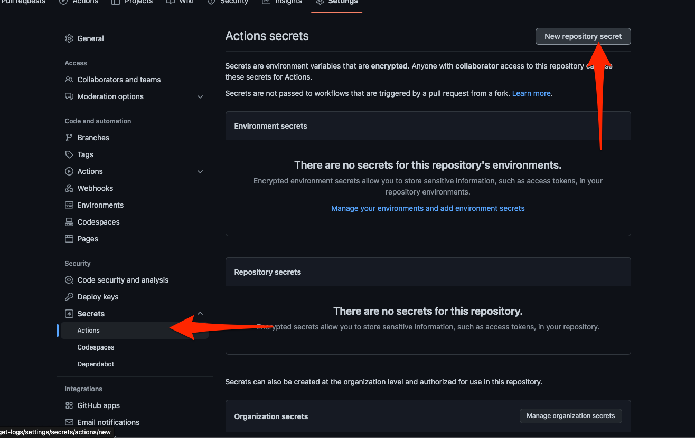
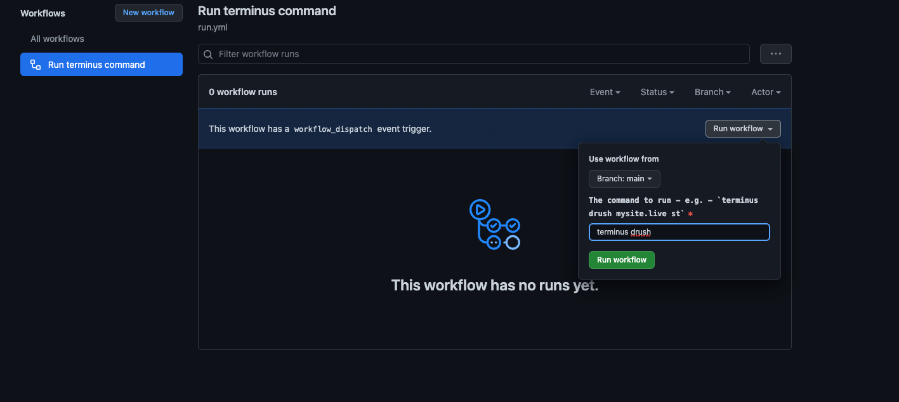

# Terminus Run
Provides a web interface for securely running Terminus CLI commands against your Pantheon site.

# Setup
- Fork this repo, since you'll need to configure your own secrets to run against your sites.
- Add a `PANTHEON_MACHINE_TOKEN` and `SSH_KEY` Action secrets for the repo. 
  
  - The `PANTHEON_MACHINE_TOKEN` should be a machine token with access to the site to analyze and upload results to. 
  - Likewise, the `SSH_KEY` should be a private key associated with the account that generated the machine token, with the public key added to the Pantheon account. E.g. if you ran `ssh-keygen`, and kept the default name of `id_rsa`, you'd want to copy the `id_rsa`, and paste it in as the `SSH_KEY` secret. Then, go to the Pantheon account settings, and add the SSH key of the `id_rsa.pub`.

## Usage
- Head to the "Actions" tab on your fork.
- Select the Action on the left hand side.
- Hit "Run workflow" on the right hand side.
- You can provide the inputs, and it will run. Check the progress in the Actions tab.


Keep in mind - You can also trigger these programmatically with the Github API! The possibilities are endless! You essentially send a JSON payload with your inputs, e.g.
```
{
    "ref": "master",
    "inputs": {
        "command": "terminus drush mysite.live cr",
        ...etc
```

For more, check out [the Github Workflow API docs.](https://docs.github.com/en/rest/actions/workflows#create-a-workflow-dispatch-event)

